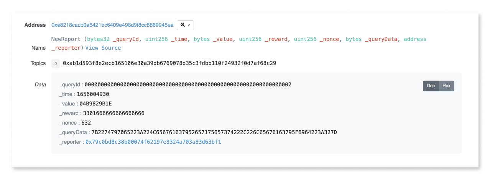

# How to Dispute

## Tutorial

* First you'll need to monitor the transactions that reporters submit on chain and identify a data report that you'd like to dispute.   You can do that using our [feeds page](https://feed.tellor.io), or the [oracle contract](https://app.gitbook.com/s/tcQlo49FAqTaOimNOz0X/the-basics/contracts-reference) directly.
* In order to dispute you'll need to collect the queryId and time from the data in the transaction log.&#x20;

* Next, locate the [correct governance contract](https://app.gitbook.com/s/tcQlo49FAqTaOimNOz0X/the-basics/contracts-reference) depending on which chain the data resides on. &#x20;
* Connect wallet funded with TRB and call the `beginDispute` function and input the `queryId` and `timestamp.`
