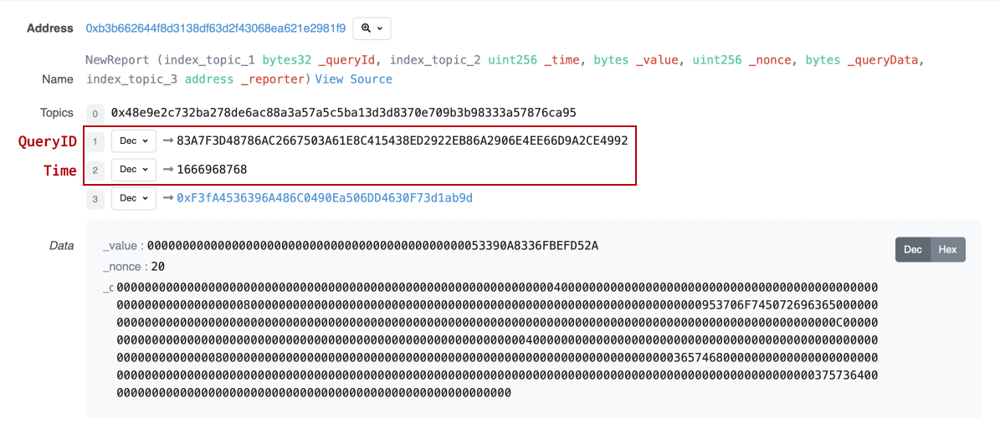
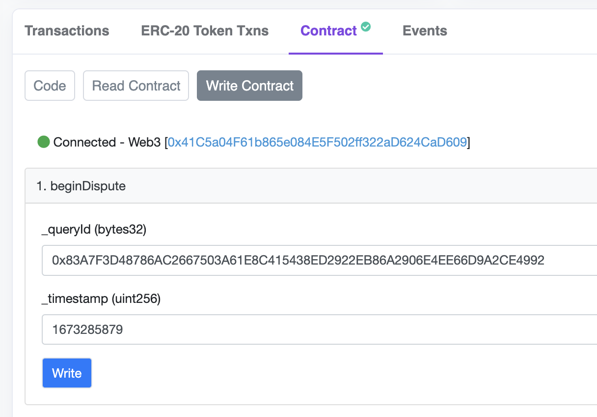

# How to Dispute


Note that before beginning a dispute, the proper amount of TRB **tokens must be approved** to the contract to cover the [disputeFee](how-to-dispute.md#dispute-fees).&#x20;

On chains other than Ethereum Mainnet you'll have to manually call the `approve` function using the network's [governance contract](https://docs.tellor.io/tellor/the-basics/contracts-reference) as the spender.


## Tutorial

* First you'll need to monitor the transactions that reporters submit on chain and identify a data report that you'd like to dispute.   You can do that using our [feeds page](https://feed.tellor.io), the [disputable values monitor](https://github.com/tellor-io/disputable-values-monitor) the [oracle contract](https://docs.tellor.io/tellor/the-basics/contracts-reference) directly.
* In order to dispute you'll need to collect the queryId and time from the data in the transaction log.&#x20;

<figure><figcaption></figcaption></figure>

* Next, locate the correct [governance contract](https://docs.tellor.io/tellor/the-basics/contracts-reference) depending on which chain the data resides on. &#x20;
* Approve the governance contract for the dispute fee (1/10th of the stake amount). Locate the [correct token contract for your network](https://docs.tellor.io/tellor/the-basics/contracts-reference). Call the `approve` function using the network's [governance contract](https://docs.tellor.io/tellor/the-basics/contracts-reference) as the spender.
* Connect your wallet with the button “connect to web3”. Under the `beginDispute` function Input the `queryId` (with a 0x at the beginning), and input the `timestamp`. Finally, click write and confirm the transaction.

<figure><figcaption></figcaption></figure>

## Dispute Fees

The dispute fee amount is variable depending on the reporter stake amount. The getDisputeFee function can be read from the Tellor governance contract on each chain. A full list of contracts can be found[ here](../the-basics/contracts-reference.md).


The disputeFee starts at 1/10th of the stakeAmount, and doubles with each voting round or with each open dispute on a given queryId. The dispute fee is capped at the stakeAmount.


## Dispute Functions

> Here is some additional explanation of how disputes work on a contract level:

Every time a new value is submitted to the oracle contract, the following event is emitted:

```solidity
event NewReport(
    bytes32 indexed _queryId,
    uint256 indexed _time,
    bytes _value,
    uint256 _nonce,
    bytes _queryData,
    address indexed _reporter
);
```

To dispute a value, go to the governance contract and run:

```solidity
/**
 * @dev Helps initialize a dispute by assigning it a disputeId
 * @param _queryId being disputed
 * @param _timestamp being disputed
 */
function beginDispute(bytes32 _queryId, uint256 _timestamp) external;
```

To get the current dispute fee:

```solidity
/**
 * @dev Get the latest dispute fee
 */
function getDisputeFee() public view returns (uint256);
```

To get the number of openDisputes on an ID:

```solidity
/**
 * @dev Returns the number of open disputes for a specific query ID
 * @param _queryId is the ID of a specific data feed
 * @return uint256 of the number of open disputes for the query ID
 */
function getOpenDisputesOnId(bytes32 _queryId)
    external
    view
    returns (uint256);
```

To open a dispute on a previously disputed value (challenge the result of the vote), simply run `beginDispute` with the same parameters (same timestamp/queryID). Note that the disputeFee will need to be doubled from the previous round, and the new round must begin after the previous vote is tallied, but before it is executed (24 hour window).

To determine whether a given value has already been disputed:

```solidity
/**
 * @dev Returns whether a given value is disputed
 * @param _queryId unique ID of the data feed
 * @param _timestamp timestamp of the value
 * @return bool whether the value is disputed
*/
function isInDispute(bytes32 _queryId, uint256 _timestamp);
    public
    view
    returns (bool);
```
