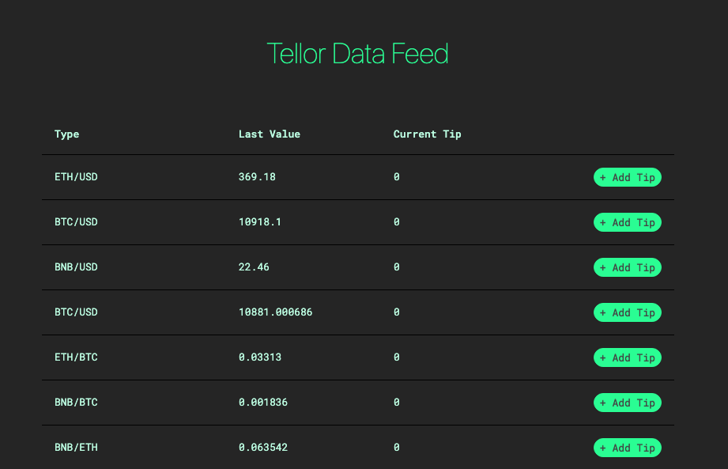

# Tip

Tellor has data update cycles we call **blocks**.  As requests for data comes into the system, the Tellor smart contract sorts the requests in a queue in order of how much **TRB "Tip"** is associated with it.  At the start of a new block the contract selects the data request with the **highest "Tip"** and issues a new challenge to the mining network to go compete at PoW and fetch that data.  Simply put, tipping incentives the Tellor network to update the data you want, and therefore can be viewed akin to a request.    
  
The flow goes like this:

1. The user submits a query to Tellor using Tributes to incentivize miners to choose this query over other submissions.
2. Other users who want the same data ‘tip’ this data series to further incentivize selection by miners.
3. Every 5 minutes, Tellor’s smart contract selects the best funded queries and provides a new challenge for miners to solve.
4. Miners submit their PoW solution and off-chain data points to the Tellor contract. The Tellor contract sorts the values as they come in and as soon as five values are received, the official value \(median of the five\) is selected and saved on-chain. The miners are then allocated their payout \(base reward and tips\).  We refer to these data update cycles as **blocks**_**.**_


**Users can add tips to the data type of their choice at the** [**Tellor Data Price Feed**](https://prices.tellorscan.com)**.**


## Tellor Data Price Feed

Adding a tip to request a specific price update is as easy as navigating to the [Tellor Data Price Feed](https://prices.tellorscan.com), with a metamask or similar web3 wallet enabled browser.   From there all you have to do is click the tip button and add the amount of your choice.

