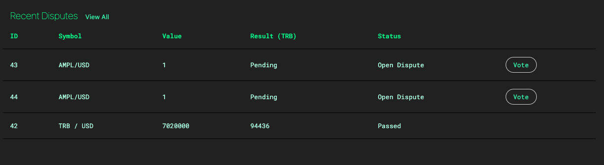
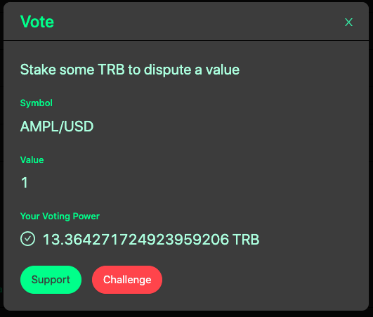
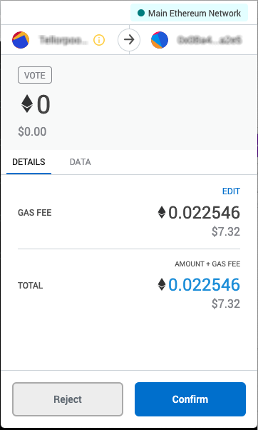

# Voting on Disputes

## About Voting

TRB holders vote on the validity of the data and if the miner is found to be malicious their stake goes to the party that initiated the dispute, otherwise the dispute fee goes to the miner.

## Prerequisites


* You will need **Metamask browser wallet or a similar web-based wallet** to connect
* You must be **holding the TRB** you will use to vote prior to the dispute being created. This prevents someone from just buying TRB to over turn a dispute after being disputed.
* TRB you use to vote with **is not at risk of being lost** due to the outcome of the vote.


## Steps for Disputing

* Go to [https://disputes.tellorscan.com](https://disputes.tellorscan.com/)
* Scroll to the bottom of the page and find the **Recent Disputes** section

*  Find the dispute with the **Open Status** and click on **Vote**
* In the window that opens, you will see **Your Voting Power** and you will see the options to **Support** or **Challenge**

* **Support:** You find the miner to be malicious and they should lose their stake.
* **Challenge:** You find the miner is not malicious and should keep their stake.
* Select either option by clicking the button

* When you click the button a **Metamask transaction** window will appear
* **Confirm** the transaction in Metamask and then click the link to **View on Etherscan**

### After the transaction is confirmed, your vote has been cast!

